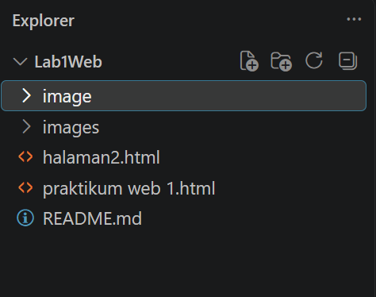

## IDENTITAS MAHASISWA

**Nama:** UGI INSAN MULYAWAN 
**NIM:** 312510268
**Kelas:**I1251C 
**Program Studi:** Teknik Informatika  
**Mata Kuliah:** Pemrograman Web  
**Praktikum:** Praktikum 1 — HTML Dasar

---

# HTML ITU APA?

HTML (*HyperText Markup Language*) merupakan bahasa markup yang digunakan untuk membuat sebuah halaman web dan menampilkan berbagai informasi di dalam browser.

HTML berupa kode-kode tag yang menginstruksikan browser untuk menghasilkan tampilan sesuai dengan yang diinginkan.

Pada praktikum ini dipelajari HTML dasar yang meliputi struktur dokumen, tag, atribut, heading, paragraf, hyperlink, gambar, list, komentar, dan pemformatan teks.

---

# Lab1Web - Praktikum 1 HTML Dasar

Repository ini berisi hasil Praktikum 1 mata kuliah Pemrograman Web
dengan materi **HTML Dasar**.

Praktikum ini membahas struktur dasar HTML, tag dan atribut, heading,
paragraf, pemformatan teks, gambar, hyperlink, list, komentar HTML,
serta penggabungan elemen HTML menjadi halaman Profil Mahasiswa.


# TUJUAN PRAKTIKUM

1. Memahami struktur dasar HTML.
2. Memahami tag-tag dasar HTML.
3. Membuat dokumen HTML.

---

## Struktur Repository

``` text
Lab1Web/
├── halaman2.html
├── praktikum web 1.html
├── image/
│   ├── hasil-browser 1.png
│   ├── hasil-browser 2.png
│   ├── hasil-browser 3.png
│   ├── hasil-browser 4.png
│   ├── hasil-browser 5.png
│   ├── hasil-browser 6.png
│   ├── hasil-browser 7.png
│   ├── hasil-browser 8.png
│   ├── hasil-browser 9.png
│   ├── hasil-browser 10.png
│   ├── struktur-coding 1.png
│   ├── struktur-coding 2.png
│   ├── struktur-coding 3.png
│   ├── struktur-coding 4.png
│   ├── struktur-coding 5.png
│   ├── struktur-coding 6.png
│   ├── struktur-coding 7.png
│   ├── struktur-coding 8.png
│   ├── struktur-coding 9.png
│   └── struktur-coding 10.png
│
├── images/
│   └── profil.jpg
│
└── README.md
```

**Screenshot struktur folder/coding:**




------------------------------------------------------------------------

# Praktikum 1: HTML Dasar

## 1. Membuat Struktur Dasar HTML

Pada tahap pertama dibuat file `index.html` dengan struktur dasar HTML
yang terdiri dari `DOCTYPE`, `html`, `head`, `title`, dan `body`.

### Coding

``` html
<!DOCTYPE html>
<html>
<head>
    <title>Praktikum HTML Dasar</title>
    <meta charset="UTF-8">
    <meta name="viewport" content="width=device-width, initial-scale=1.0">
</head>
<body>

</body>
</html>
```

### Screenshot Coding


### Hasil pada Browser

Setelah file `index.html` disimpan dan dibuka melalui browser, halaman menampilkan dokumen HTML dasar. Pada tahap ini halaman masih sederhana karena belum terdapat isi di dalam bagian `<body>`.


------------------------------------------------------------------------

## 2. Membuat Paragraf

Selanjutnya ditambahkan dua paragraf menggunakan tag `<p>`.

### Coding

``` html
<!-- Judul Utama -->
 
<p>
    Kami sedang belajar HTML dasar pada mata kuliah Pemrograman Web.
    Praktikum ini digunakan untuk mengenal tag-tag dasar HTML.
</p>

<!-- Ini adalah paragraf kedua -->
 <!-- subjudul -->
<p>
    HTML digunakan untuk menyusun struktur dan konten halaman web.
    Browser akan menampilkan hasil interpretasi dari dokumen HTML.
</p>
```

### Screenshot Coding


### Hasil pada Browser

Setelah paragraf ditambahkan, browser menampilkan dua bagian teks yang dibuat menggunakan tag `<p>`. Setiap tag `<p>` menghasilkan sebuah paragraf baru sehingga teks terlihat terpisah pada halaman.


------------------------------------------------------------------------

## 3. Menambahkan Judul

Heading digunakan untuk memberikan judul utama dan subjudul pada
halaman.

### Coding

``` html
<!-- judul utama -->
<h1>Belajar Dasar HTML</h1>

<!-- subjudul -->
<h3>Paragraf pada HTML</h3>
```

### Screenshot Coding


### Hasil pada Browser

Setelah heading ditambahkan, browser menampilkan judul utama menggunakan `<h1>` dan subjudul menggunakan `<h2>`. Ukuran teks `<h1>` lebih besar daripada `<h2>` sehingga terlihat sebagai judul utama dan subjudul.


------------------------------------------------------------------------

## 4. Memformat Teks

Pada tahap ini digunakan beberapa tag pemformatan teks seperti `<b>`,
`<i>`, `<strong>`, `<sub>`, dan `<sup>`.

### Coding

``` html
<p>
    Kami sedang belajar <b>HTML dasar</b> pada mata kuliah
    <i>Pemrograman Web</i>.
</p>

<p>
    HTML merupakan <strong>bahasa markup</strong> untuk menyusun
    struktur halaman web.
</p>

<p>
    Air ditulis sebagai H<sub>2</sub>O dan luas dapat ditulis
    sebagai x<sup>2</sup>.
</p>
```

### Screenshot Coding


### Hasil pada Browser

Pada browser, teks yang menggunakan `<b>` tampil tebal, teks dengan `<i>` tampil miring, dan teks dengan `<strong>` menunjukkan teks penting. Tag `<sub>` digunakan pada angka kecil di bawah seperti H₂O, sedangkan `<sup>` digunakan pada angka kecil di atas seperti x².


------------------------------------------------------------------------

## 5. Menyisipkan Gambar

Gambar ditambahkan menggunakan tag `` dan disimpan di dalam folder
`images`.

### Struktur Folder

``` text
praktikum-1-html-dasar/
├── index.html
└── images/
    └── profil.jpg
```

### Coding

``` html
<h3>Menambahkan Gambar</h3>


```

### Screenshot Coding


### Hasil pada Browser

Setelah file gambar diletakkan di folder `images` dan path pada atribut `src` ditulis dengan benar, browser menampilkan gambar profil pada halaman. Atribut `width` digunakan untuk menentukan lebar gambar.


------------------------------------------------------------------------

## 6. Mengatur Ukuran Gambar

Ukuran gambar dapat diatur menggunakan atribut `width` dan `height`.

### Coding

``` html

     
```

Nilai `width` dapat diubah untuk melihat perubahan ukuran gambar pada
browser.

### Screenshot Coding


### Hasil pada Browser

Setelah nilai `width` diubah, ukuran gambar yang tampil pada browser ikut berubah. Tahap ini menunjukkan bahwa atribut ukuran dapat digunakan untuk mengatur tampilan gambar.


------------------------------------------------------------------------

## 7. Menambahkan Hyperlink

Dibuat file `halaman2.html` untuk menguji hyperlink internal dan
eksternal.

### Coding

``` html
<nav>
    <a href="index.html">Dasar HTML</a>
    <a href="halaman2.html">Halaman 2</a>
    <a href="https://www.google.com">Website Eksternal</a>
</nav>

<hr>
```

### Screenshot Coding


### Hasil pada Browser

Browser menampilkan beberapa hyperlink yang dapat digunakan untuk berpindah halaman. Link `index.html` menuju halaman utama, `halaman2.html` menuju halaman kedua, sedangkan link Google menuju website eksternal.


------------------------------------------------------------------------

## 8. Menambahkan List

Pada tahap ini dibuat unordered list dan ordered list.

### Coding

``` html
<h2>Keahlian</h2>
<ul>
    <li>HTML</li>
    <li>CSS</li>
    <li>JavaScript</li>
</ul>

<h2>Urutan Belajar</h2>
<ol>
    <li>Mempelajari struktur HTML</li>
    <li>Mempelajari tag dan atribut</li>
    <li>Membuat halaman HTML</li>
    <li>Menguji halaman pada browser</li>
</ol>
```

### Screenshot Coding


### Hasil pada Browser

Browser menampilkan daftar keahlian menggunakan unordered list sehingga item menggunakan tanda bullet. Bagian urutan belajar menggunakan ordered list sehingga item ditampilkan menggunakan nomor secara berurutan.


------------------------------------------------------------------------

## 9. Menambahkan Komentar

Komentar digunakan sebagai penanda pada bagian kode dan tidak
ditampilkan oleh browser.

### Coding

``` html
<!-- Bagian Profil Mahasiswa -->
<h2>Profil Mahasiswa</h2>

<!-- Bagian Keahlian -->
<ul>
    <li>HTML</li>
    <li>CSS</li>
</ul>
```

### Screenshot Coding


### Hasil pada Browser

Komentar HTML tidak ditampilkan pada halaman browser. Komentar hanya berfungsi sebagai keterangan atau penanda di dalam kode sehingga tampilan browser tetap menampilkan bagian HTML yang bukan komentar.


------------------------------------------------------------------------

# 10. Menggabungkan Semua Elemen

Pada tahap terakhir seluruh elemen yang telah dipelajari digabungkan
menjadi halaman **Profil Mahasiswa**.

### Coding

``` html
<!DOCTYPE html>
<html>
<head>
    <title>Profil Mahasiswa</title>
</head>

<body>

<nav>
    <a href="index.html">Beranda</a>
    <a href="halaman2.html">Halaman 2</a>
</nav>

<hr>

<h1>Profil Mahasiswa</h1>


<h2>Data Diri</h2>

<p>
    Nama: Nama Mahasiswa
</p>

<p>
    Program Studi: Teknik Informatika
</p>

<p>
    Saya sedang mempelajari dasar-dasar pengembangan
    aplikasi web menggunakan HTML.
</p>

<h2>Keahlian</h2>

<ul>
    <li>HTML</li>
    <li>CSS</li>
    <li>JavaScript</li>
</ul>

<h2>Target Belajar</h2>

<ol>
    <li>Menguasai HTML</li>
    <li>Menguasai CSS</li>
    <li>Menguasai JavaScript</li>
</ol>

</body>
</html>
```

### Screenshot Coding Keseluruhan


### Hasil pada Browser

Setelah seluruh elemen digabungkan, browser menampilkan halaman Profil Mahasiswa yang berisi navigasi, foto profil, data diri, daftar keahlian, dan target belajar. Tahap ini merupakan hasil penggabungan materi HTML yang telah dipraktikkan sebelumnya.


------------------------------------------------------------------------

# Kesimpulan

Pada Praktikum 1 ini telah dipelajari dasar-dasar HTML, mulai dari
membuat struktur dokumen HTML hingga menggabungkan berbagai elemen
menjadi sebuah halaman Profil Mahasiswa.

Materi yang telah dipraktikkan meliputi:

-   Struktur dasar HTML
-   Heading
-   Paragraf
-   Pemformatan teks
-   Gambar
-   Hyperlink
-   Unordered list
-   Ordered list
-   Komentar HTML
-   Penggabungan elemen HTML

# Checklist Praktikum

-   [x] Struktur HTML sudah dibuat.
-   [x] Heading dan paragraf sudah digunakan.
-   [x] Pemformatan teks sudah dicoba.
-   [x] Gambar sudah ditambahkan.
-   [x] Hyperlink internal dan eksternal sudah dibuat.
-   [x] Unordered list dan ordered list sudah dibuat.
-   [x] Komentar HTML sudah dicoba.
-   [x] Screenshot setiap tahap sudah dimasukkan.
-   [x] Repository sudah di-commit.
-   [x] URL repository siap dikirim.


